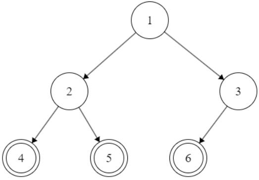
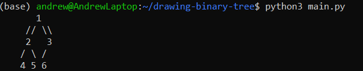

# Drawing Binary Heap Trees


Author: [Andrew Gyakobo](https://github.com/Gyakobo)

This project serves to display an ordered and balanced heap binary trees in the stdout console.

## Introduction

To start off, a `binary heap` is only a complete binary tree that satisfies the heap property. There are two types of binary heaps:

1. `Max-Heap:` In a max-heap, for any given node $i$:
    * The value $i$ is greater than or equal to the values of its children.
    * This means that the largest element is at the root of the heap.

1. `Min-Heap:` In a min-heap, for any given node $i$:
    * The value of $i$ is less than or equal to the values of its children.
    * This means that the smallest element is at the root of the heap.

### Fun facts about the applications of Binary Heaps

* `Priority Queues:` Binary heaps are commonly used to implement priority queues where the highest (or lowest) priority element needs to be efficiently retrieved.

* `Heapsort Algorithm:` A comparison-based sorting technique that uses a binary heap data structure.

* `Graph Algorithm:` Such as Dijkstra's shortest path algorithm and Prim's minimum spanning tree algorithm, which frequently use priority queues.

### Representation in Arrays:

Binary heaps are often represented as arrays data structures because they can be easily managed using array indices:

* For a node at index $i$:
    * The left child is at index $2i + 1$
    * The right child is at index $2i + 2$
    * The parent is at index $\lfloor \frac{i-1}{2} \rfloor$

This array-based representation is efficient in terms of memory and performance allowing for fast access and updates.

## Methodolgy

1. Let's first import the `ceil` and `log2` functions from the math library:  

```python
from math import ceil, log2
```

2. Afterwards, let's now create the empty grid per the dimensions of the given binary tree heap:

```python
def draw_heap_on_grid(heap):
    if not heap:
        return "Heap is empty"

    # Get the height of the tree
    height_of_tree = ceil(log2(len(heap) + 1))

    # Per a math formula let's get the grid dimensions
    grid_width = (2 ** height_of_tree) * 2 - 1
    grid_height = (height_of_tree*2) - 1

    # Now let's create and fill the grid with empty cells
    # grid: grid_height x grid_width 
    grid = [[" " for _ in range(grid_width)] for _ in range(grid_height)]
```

3. And finally let's create a Depth-First Search (DFS) heap tree traversal approach which would go node-by-node child-by-child inside the `draw_heap_on_grid`, run it with the root node coordinates, and return the final grid in text form:

```python
# Now let's start placing the nodes in the grid
def dfs_draw_node(index, current_depth_in_tree, position_in_grid):
    if index >= len(heap):
        return

    grid[current_depth_in_tree * 2][position_in_grid] = str(heap[index]) 

    # Get the left and right children positions
    left_child_position     = position_in_grid - 2 ** (height_of_tree - current_depth_in_tree - 2)
    right_child_position    = position_in_grid + 2 ** (height_of_tree - current_depth_in_tree - 2)

    # Draw connections
    if 2 * index + 1 < len(heap):
        for i in range(1, 2 ** (height_of_tree - current_depth_in_tree - 2)+1):
            grid[current_depth_in_tree * 2 + 1][position_in_grid - i] = "/"
    if 2 * index + 2 < len(heap):
        for i in range(1, 2 ** (height_of_tree - current_depth_in_tree - 2)+1):
            grid[current_depth_in_tree * 2 + 1][position_in_grid + i] = "\\"

    # Now the recursion
    # We shall rerun and recursively place the children
    dfs_draw_node(2 * index + 1, current_depth_in_tree + 1, left_child_position)
    dfs_draw_node(2 * index + 2, current_depth_in_tree + 1, right_child_position)

# Now let's start with the root node
dfs_draw_node(0, 0, grid_width // 2)

# Return the grid
return "\n".join("".join(row) for row in grid)
```

4. And finally let's run the program with a `heap = [1, 2, 3, 4, 5, 6, 7, 8, 9]`:

```python
heap = [1, 2, 3, 4, 5, 6] 
print(draw_heap_on_grid(heap))
```

## Results

Thus having run [main.py](https://github.com/Gyakobo/Drawing-Binary-Heap-Trees/blob/main/main.py) the binary heap tree hypothetically should be reprented in the following form:



The program, however, will output the tree in the console in the next form:



## License
MIT
